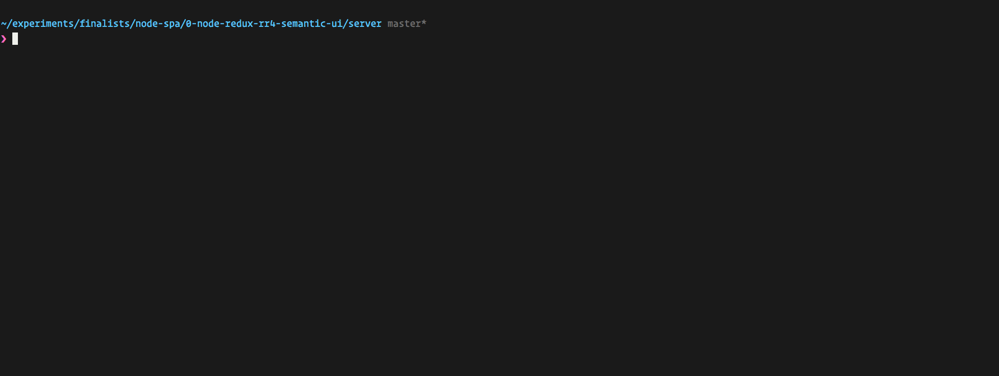

# mngs


A pleasant CLI for rapid development with Mongoose.




## Quickstart

```
$ yarn add --dev mngs
```

And add the following script to your `package.json` file:

```json
"scripts":{
    "mongoose":"MNGS_MODELS=config/mngs.js mngs"
}
```

And here's how `config/mngs.js` looks like:

```javascript
// connects mongoose. grab your own setup
require('./mongoose-setup.js')

// exports a map, e.g. { User: <mongoose model>, Post: <mongoose model> }
const models = require(path.join(__dirname, '../models'))
module.exports = models
```

# Usage

Use your models (they are exposed directly) to print `p`, log `l`, and display on a table `t`.
Additionally you can simulate a `toJSON` with `js` to see what part of your model is exposed.

```
>> t(User.find())
>> p(User.find())
>> l(User.find())
>> js(User.find())
```


# Contributing

Fork, implement, add tests, pull request, get my everlasting thanks and a respectable place here :).


### Thanks:

To all [Contributors](https://github.com/jondot/mngs/graphs/contributors) - you make this happen, thanks!


# Copyright

Copyright (c) 2017 [Dotan Nahum](http://gplus.to/dotan) [@jondot](http://twitter.com/jondot). See [LICENSE](LICENSE) for further details.
